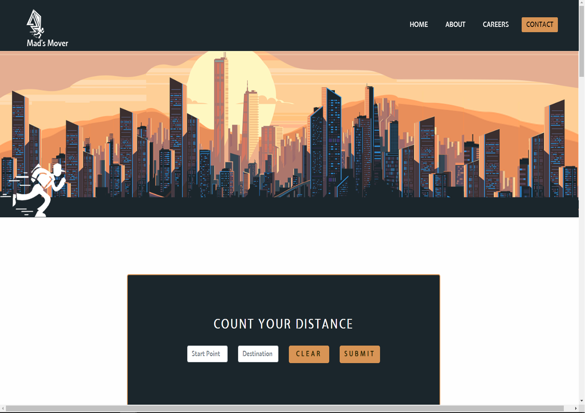
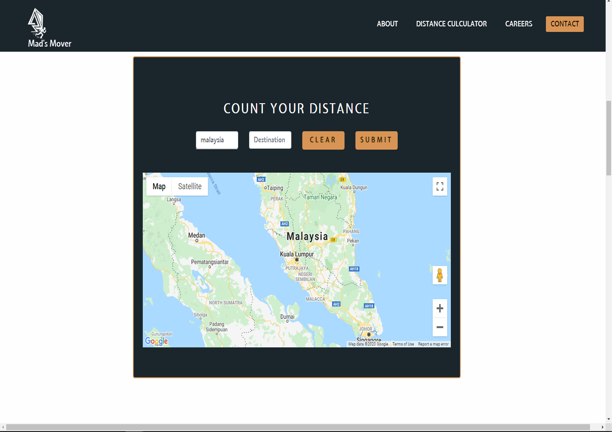
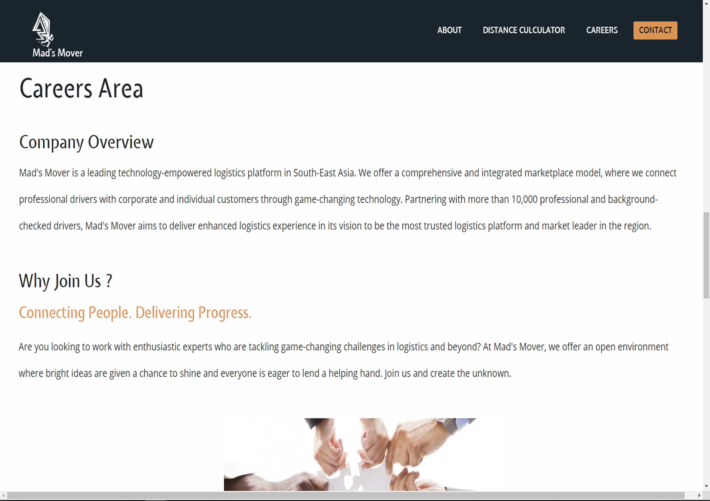
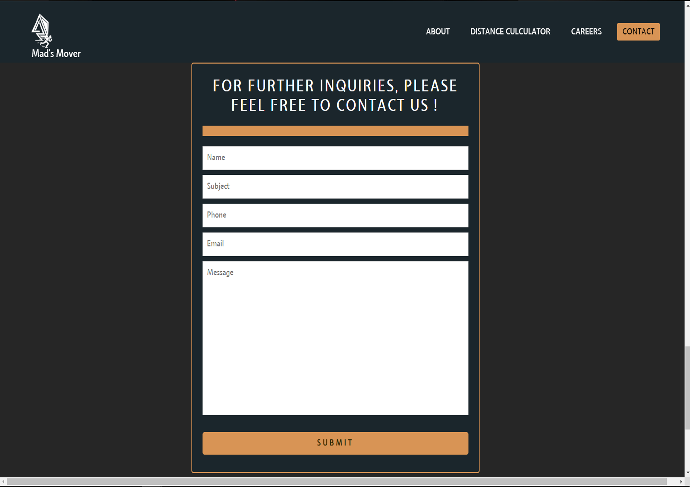

### Project Discription.

**Mad's Lab.**

Mad's Lab is a company that serve multiple service to the customer in architecture and web design field.

## Table of contents
* [Ux](#Ux)
* [Feature](#Feature)
* [Technologies-Used](#Technologies-Used)
* [Deployment](#Deployment)
* [Credits](#Credits)
* [Acknowledgements](#Acknowledgements)

## Ux
What is Mad's Mover ?
  * Mad's Mover is a fast and easy lorry rental ("lori sewa"), van and 4x4 booking platform. We provide services such as lorry transport, professional house moving, furniture disposal and office moving.
    We partner with reputable and experienced drivers to ensure that your goods will be transported safely and securely to your final destination.
    Try it out now to experience a new and fresh way to book cargo transportation in Malaysia!

## Feature

    - On arriving at the page for the first time, this word have been shown to inform the user what this website is about.

    - On the upper of the footer, the picture is show to the user the example of the previous project that have been done by Mad's Lab team.
    - In the footer area, the information of the company detail have given to the user for them to contact Mad's Lab.

    - On the price page, the Mad's Lab price list is given to the user for the rate price based on the situation.

    - On the last page, in the application page which is if the user want to hire or want to join our team, they can fill in the form. All the data will be collected.

## Technologies Used

* GitHub
  - This project uses GitHub to store and share all project code remotely.
  - The new GitHub Projects planner was utilised to plan and keep track of this project. This project plan can be viewed here.
  
* GitPod
  - Developer used GitPod for their IDE while building the website.
  
* Photoshop
  - his project used tools in Photohshop to edit, crop and save images as well as ulitising the colour picker to ensure color     consistency over the entire project.
  
* Google Fonts
  - The project uses Google fonts to style the website fonts.
  
* Bootstrap
  - The project uses Bootstrap to simplify the structure of the website and make the website responsive easily.
  - The project also uses Bootstrap to provide icons from FontAwesome

* W3c Validator
  - Using this website to check all the error in html.

## Deployment
This project was developed using the GitPod, and pushed to GitHub using the built in function within GitPod.
To deploy the Mad's Lab, to GitHub Pages from its GitHub repository, the following steps have to be done:
  - Log into GitHub.
  - Navigate the GitHub repository.
  - Click on the setting tab at the top of the repository bar.
  - Scroll down on that page to the GitHub Pages section.
  - The first drop-down field should be Source with None preselected.
  - Select master branch from the list.
  - The page should refresh.
  - Scroll back down to the GitHub Pages section.
  - You should now have a deployed link.
  
The Mad's Lab project made use of several branches for development, testing and bug fixing. The Master Branch has always been the one deployed to GitHUb Pages. When displaying the website life, the developer tries to keep the master branch to optimal code only. At the moment of submitting this Milestone project the Development Branch and Master Branch are identical.

## Credits

**Content**
* All the content in this project is written by muhammad syafiq.

**Media**
* Image
  - Most the building images in this project is own by Muhammad Syafiq previous architecture degree project.
  - The personal computer image by Muhammad Syafiq life experience.
  - The Google Images and are used for project purposes only.
  
**Code**
* Reference code for the html and css are referred from W3School post. 

## Acknowledgements
Special thanks to:
* Code Institute Mentor, Miss Antonija Simic for his time and support in explaining and demonstrating areas of code this developer was struggling to understand.
* Code Institute Tutor, for their time and support in explaining and demonstrating areas of code this developer was struggling to understand. 
 
A fully responsive website using CSS and HTML5

